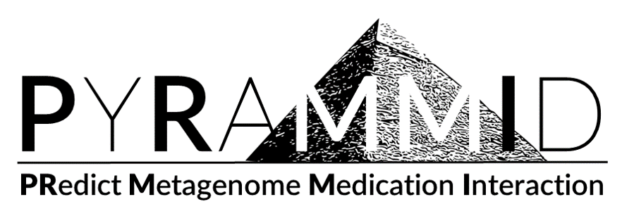
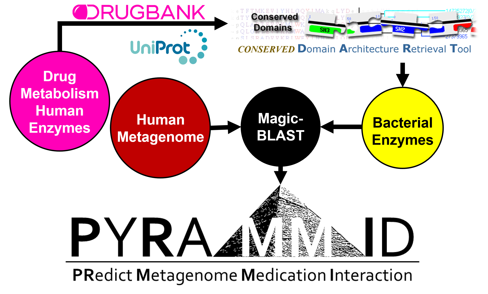
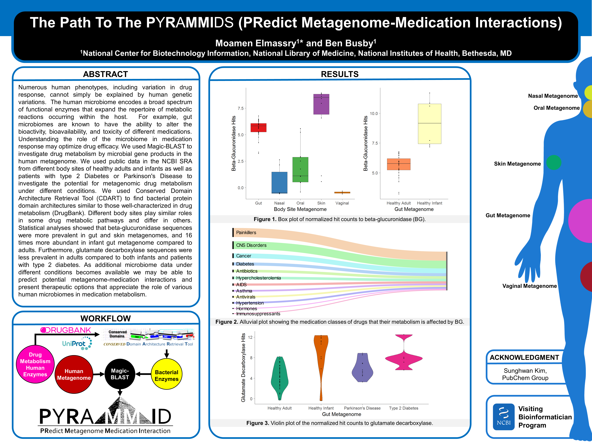

# PYRAMMID (PRedict Metagenome Medication Interaction)

A simple pipeline to predict metagenome medication Interaction.




## Principle

To achieve this, we are using Magic-BLAST tool, which is a tool for mapping large next-generation RNA or DNA sequencing runs against a whole genome or transcriptome. Using publicly available Sequence Read Archive (SRA) of human metagnome as a query and in-house enzymes database that is based on the human enzymes invoved in drug metabolism, we may predict the metabolic enzymatic capacity of human metagenomes. This will achieve our goal, to predict potential metagenome medication interactions.


## How it works

First, building a BLAST database of the metabolic enzymes of interest that will be used as a reference
```
    makeblastdb -in my_reference.fa -parse_seqids -dbtype nucl
```
Second, running Magic-BLAST against the chosen metagenomes SRA accessions
```
    magicblast -sra SRR6865476,SRR1031478,SRR5826659 -db my_reference.fa -paired -num_threads 6 -outfmt tabular -no_unaligned -reftype transcriptome > output.foo
```

This is a poster showing some preliminary results from our pipeline

